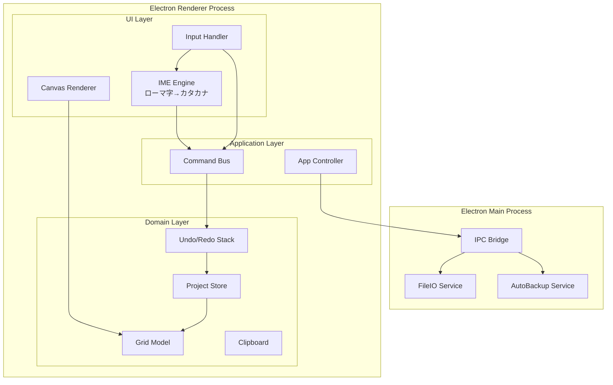
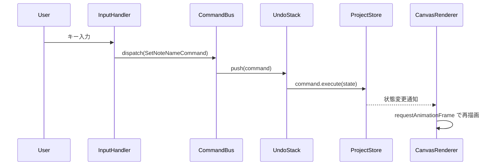

# 設計ドキュメント: score-notation-app

## 概要

score-notation-app は、MacBook向けの軽量デスクトップ採譜アプリである。格子状のグリッドに音名を入力することで、音楽的アイデアを素早く記録することを目的とする。音声再生機能は持たず、完全無音で動作する。

### 設計方針

- **パフォーマンス最優先**: 100,000セルを超える場合でも全操作を16ms以内に完了させる
- **IME非依存**: ローマ字→カタカナ変換をアプリ内で独自処理し、OSのIMEを介さない
- **Canvasベースレンダリング**: DOM操作では100,000セルのパフォーマンスを維持できないため、HTML5 Canvas（または OffscreenCanvas）を採用する
- **Electronによる実装**: macOSネイティブAPIへのアクセスとWeb技術の両立のため Electron を採用する

### 技術スタック

| 層 | 技術 |
|---|---|
| シェル | Electron (macOS) |
| レンダリング | HTML5 Canvas / OffscreenCanvas |
| ロジック | TypeScript |
| 状態管理 | イミュータブルなコマンドパターン（Undo/Redo対応） |
| 永続化 | JSON ファイル（ローカルファイルシステム） |
| テスト | Vitest + fast-check（プロパティベーステスト） |

---

## アーキテクチャ

### 全体構成



### レイヤー責務

| レイヤー | 責務 |
|---|---|
| UI Layer | Canvas描画・キーボード/マウスイベント受信・IME変換 |
| Application Layer | コマンドのディスパッチ・Undo/Redo管理 |
| Domain Layer | グリッドデータモデル・ビジネスロジック |
| Main Process | ファイルI/O・自動バックアップ・OS連携 |

### コマンドパターンによるUndo/Redo

全ての状態変更はコマンドオブジェクトとして表現する。各コマンドは `execute()` と `undo()` を持ち、UndoStackで管理する。



---

## コンポーネントとインターフェース

### IMEEngine（ローマ字→カタカナ変換）

OSのIMEを使わず、アプリ内でローマ字入力をカタカナに変換するエンジン。

```typescript
interface IMEEngine {
  // キーストロークを受け取り、確定したNoteNameがあれば返す
  // 確定しない場合は null を返す
  feed(key: string): NoteName | null;
  // 現在の未確定バッファをリセット
  reset(): void;
  // 現在の未確定入力バッファ（表示用）
  readonly pending: string;
  // 現在のオクターブ方向プレフィックス（'up' = /、'down' = ¥、null = なし）
  readonly octaveDirectionPrefix: 'up' | 'down' | null;
}
```

有効なNoteNameとローマ字マッピング:

| NoteName | ローマ字シーケンス |
|---|---|
| ド | do |
| ノ | no |
| レ | re |
| ネ | ne |
| ミ | mi |
| ハ | ha |
| バ | ba |
| ソ | so |
| ゾ | zo |
| ラ | ra |
| ジ | zi / ji |
| シ | si / shi |
| x | x |
| ー | - (ハイフン) |
| ッ | ltu / ltsu / tu / tsu |

### CanvasRenderer

グリッド全体を Canvas に描画するコンポーネント。仮想スクロールにより表示領域のみを描画する。

```typescript
interface CanvasRenderer {
  // グリッド全体を再描画（差分描画ではなく全体再描画）
  render(state: RenderState): void;
  // ビューポートのスクロール位置を更新
  setViewport(x: number, y: number): void;
  // Canvas上の座標からCellまたはBarの参照を返す
  hitTest(canvasX: number, canvasY: number): HitTestResult;
}

interface RenderState {
  project: Project;
  selection: SelectionState;
  dragPreview: DragPreviewState | null;
  activeCell: CellRef | null;
}

// セルへの参照
interface CellRef {
  trackId: string;
  cellId: string;
}

// OctaveShiftドラッグ中のプレビュー状態
interface DragPreviewState {
  cellRef: CellRef;         // ドラッグ中のセル
  previewOctave: number;    // 仮のオクターブ値（未確定）
}

// ヒットテスト結果
type HitTestResult =
  | { type: 'cell'; trackId: string; cellId: string }
  | { type: 'bar'; barIndex: number }
  | { type: 'none' };
```

### CommandBus

```typescript
interface Command {
  execute(state: ProjectState): ProjectState;
  undo(state: ProjectState): ProjectState;
}

interface CommandBus {
  dispatch(command: Command): void;
  undo(): void;
  redo(): void;
  readonly canUndo: boolean;
  readonly canRedo: boolean;
}
```

### FileIOService（Main Process）

```typescript
interface FileIOService {
  save(filePath: string, data: SerializedProject): Promise<void>;
  load(filePath: string): Promise<SerializedProject>;
  saveBackup(data: SerializedProject): Promise<void>;
  // 古いバックアップを削除して最大36世代を維持
  pruneBackups(): Promise<void>;
}
```

---

## データモデル

### コアドメインモデル

```typescript
// 音名（15種類）
type NoteName =
  | 'ド' | 'ノ' | 'レ' | 'ネ' | 'ミ' | 'ハ' | 'バ'
  | 'ソ' | 'ゾ' | 'ラ' | 'ジ' | 'シ'  // 12音
  | 'x' | 'ー' | 'ッ';                  // SpecialNoteName

// 特殊音（オクターブ概念なし）
type SpecialNoteName = 'x' | 'ー' | 'ッ';
// 音価
type NoteValue =
  | 'whole'        // 全音符
  | 'half'         // 2分音符
  | 'quarter'      // 4分音符
  | 'eighth'       // 8分音符（デフォルト）
  | 'sixteenth'    // 16分音符
  | 'thirty_second'// 32分音符
  | 'half_triplet'     // 2分3連符
  | 'quarter_triplet'  // 4分3連符
  | 'eighth_triplet'   // 8分3連符
  | 'sixteenth_triplet'; // 16分3連符

// 音価の基準単位（32分音符=1）に対する相対幅
const NOTE_VALUE_UNITS: Record<NoteValue, number> = {
  whole: 32,
  half: 16,
  quarter: 8,
  eighth: 4,
  sixteenth: 2,
  thirty_second: 1,
  half_triplet: 32 / 3,      // ≈10.67
  quarter_triplet: 16 / 3,   // ≈5.33
  eighth_triplet: 8 / 3,     // ≈2.67
  sixteenth_triplet: 4 / 3,  // ≈1.33
};

// セル（MelodyTrack用）
interface MelodyCell {
  id: string;
  noteValue: NoteValue;
  noteName: NoteName | null;  // null = 未記入
  octave: number | null;      // SpecialNoteNameの場合はnull（A1=1, C6=6）
}

// セル（TextTrack用）
interface TextCell {
  id: string;
  noteValue: NoteValue;
  text: string;  // 空文字 = 未記入
}

type Cell = MelodyCell | TextCell;

// トラック
interface MelodyTrack {
  id: string;
  type: 'melody';
  name: string;
  currentNoteValue: NoteValue;  // 初期値: 'eighth'
  cells: MelodyCell[];
}

interface TextTrack {
  id: string;
  type: 'text';
  name: string;
  cells: TextCell[];
}

type Track = MelodyTrack | TextTrack;

// 拍子
interface TimeSignature {
  numerator: number;    // 分子（例: 4）
  denominator: number;  // 分母（例: 4）
}

// プロジェクト
interface Project {
  id: string;
  name: string;
  timeSignature: TimeSignature;
  defaultSystemBreak: number;  // 初期値: 4
  localSystemBreaks: Record<number, number>;  // systemIndex -> barCount
  tracks: Track[];
  createdAt: string;  // ISO 8601
  updatedAt: string;
}
```

### Pitch計算モデル

Pitch（NoteName + octave）から縦方向オフセット（ピクセル）を算出する。

```typescript
// 対応音域: A1〜C6（計52音）
// 半音ステップ数（C1=0 を基準）
const NOTE_NAME_SEMITONE: Record<Exclude<NoteName, SpecialNoteName>, number> = {
  'ド': 0,  // C
  'ノ': 1,  // C#/Db
  'レ': 2,  // D
  'ネ': 3,  // D#/Eb
  'ミ': 4,  // E
  'ハ': 5,  // F
  'バ': 6,  // F#/Gb
  'ソ': 7,  // G
  'ゾ': 8,  // G#/Ab
  'ラ': 9,  // A
  'ジ': 10, // A#/Bb
  'シ': 11, // B
};

// VerticalOffset = (最高音 - 現在の半音数) * SEMITONE_HEIGHT_PX
// 最高音: C6 = semitone 60+0 = 72 (C1=0基準で octave*12)
const SEMITONE_HEIGHT_PX = 4; // 1半音あたりのピクセル高さ
```

### シリアライズ形式（JSON）

```typescript
// ファイル保存用のシリアライズ形式
interface SerializedProject {
  version: number;  // スキーマバージョン（現在: 1）
  project: Project;
}
```

### 選択状態モデル

```typescript
type SelectionState =
  | { type: 'none' }
  | { type: 'cell'; trackId: string; cellId: string }
  | { type: 'cell_range'; trackId: string; startCellId: string; endCellId: string }
  | { type: 'bar'; barIndex: number }
  | { type: 'bar_range'; startBarIndex: number; endBarIndex: number }
  | { type: 'multi_track_range'; tracks: Array<{ trackId: string; startCellId: string; endCellId: string }> };

// クリップボード
interface ClipboardData {
  type: 'cells' | 'bar';
  tracks: Array<{
    trackType: 'melody' | 'text';
    cells: Cell[];
  }>;
}
```

### コマンド一覧

```typescript
// NoteName設定（オクターブは自動決定済みの値を受け取る）
interface SetNoteNameCommand extends Command {
  trackId: string;
  cellId: string;
  newNoteName: NoteName | null;
  newOctave: number | null;  // SpecialNoteNameの場合はnull
}

// OctaveShift
interface OctaveShiftCommand extends Command {
  trackId: string;
  cellId: string;
  delta: 1 | -1;
}

// NoteValue変更（セルの吸収・分割を含む）
interface ChangeNoteValueCommand extends Command {
  trackId: string;
  cellId: string;
  newNoteValue: NoteValue;
}

// トラック追加・削除
interface AddTrackCommand extends Command {
  trackType: 'melody' | 'text';
  insertIndex: number;
}

interface RemoveTrackCommand extends Command {
  trackId: string;
}

// コピー・ペースト
interface PasteCommand extends Command {
  clipboard: ClipboardData;
  targetTrackId: string;
  targetCellId: string;
}

// トラック複製
interface DuplicateTrackCommand extends Command {
  trackId: string;
}
```


---

## 正確性プロパティ

*プロパティとは、システムの全ての有効な実行において成立すべき特性または振る舞いのことである。本質的には「システムが何をすべきか」についての形式的な記述であり、人間が読める仕様と機械で検証可能な正確性保証の橋渡しをする。*

### プロパティ1: NoteValueとセル幅の比例関係

*任意の* 2つのNoteValueに対して、音価の比率とセルのピクセル幅の比率が等しい。すなわち、全音符のセル幅は8分音符のセル幅の8倍でなければならない。

**検証対象: 要件1.4**

---

### プロパティ2: SystemBreakによる全トラック統一折り返し

*任意の* トラック数とSystemBreak値に対して、全てのトラックが同一のSystemBreak位置で折り返される。すなわち、あるトラックのn番目のSystemBreak位置は、他の全てのトラックのn番目のSystemBreak位置と等しい。

**検証対象: 要件1.6, 1.10**

---

### プロパティ3: LocalSystemBreakの局所適用

*任意の* systemIndexとLocalSystemBreak値に対して、そのsystemIndexの段のみが指定された小節数で折り返され、他の段はDefaultSystemBreakを使用する。

**検証対象: 要件1.9**

---

### プロパティ4: セルの時間軸位置不変性

*任意の* 操作（NoteName入力・NoteValue変更・トラック追加削除・コピーペースト）の後も、操作対象外のセルのBar上の位置（barIndex）は変化しない。

**検証対象: 要件1.11**

---

### プロパティ5: IMEエンジンのローマ字→NoteName変換

*任意の* 有効なローマ字シーケンス（do, no, re, ne, mi, ha, ba, so, zo, ra, zi/ji, si/shi, x, -, tsu/tu）に対して、IMEエンジンは対応するNoteNameを返す。また、いずれのNoteNameにも対応しないシーケンスに対してはnullを返す。

**検証対象: 要件2.2, 2.5**

---

### プロパティ6: NoteName表示のカタカナ統一

*任意の* NoteName（12音）に対して、MelodyTrackのセルに表示される文字はカタカナである。xは半角で表示される。

**検証対象: 要件2.4**

---

### プロパティ7: VerticalOffsetの単調性

*任意の* 2つのPitch（NoteName + octave）に対して、Pitchが高い方のVerticalOffsetは低い方のVerticalOffsetより小さい（上方向）。また、音域（A1〜C6）内の全てのPitchは互いに異なるVerticalOffsetを持つ。

**検証対象: 要件3.1, 3.2, 3.3, 3.4**

---

### プロパティ8: SpecialNoteName（ー・ッ）のVerticalOffset継承

*任意の* セル列において、ー または ッ のVerticalOffsetは、PrecedingNoteName（ー・ッ除く）のVerticalOffsetと等しい。PrecedingNoteName（ー・ッ除く）が存在しない場合は固定位置（VerticalOffset=0）となる。

**検証対象: 要件3.6, 3.7**

---

### プロパティ9: OctaveShiftの適用と音域クランプ

*任意の* NoteName（SpecialNoteNameを除く）とoctaveに対して、OctaveShiftを適用した結果のoctaveは音域（A1〜C6）の範囲内にクランプされる。上方向ドラッグは+1、下方向ドラッグは-1を適用し、範囲外の場合は上限または下限に丸める。

**検証対象: 要件4.1, 4.2, 4.5**

---

### プロパティ10: NoteValue変更後のセル総量保存

*任意の* トラックとNoteValue変更操作に対して、変更前後でトラック全体の「音価単位の合計」は変化しない。長い音価への変更では後続セルが吸収され、短い音価への変更では新規セルが追加されるが、合計音価単位数は保存される。また、変更対象セルのNoteNameは変更前後で同一である。

**検証対象: 要件5.5, 5.6, 5.7, 5.8, 5.9**

---

### プロパティ11: CurrentNoteValueの新規セルへの適用

*任意の* CurrentNoteValue設定後に追加される新規セルは、そのCurrentNoteValueを持つ。

**検証対象: 要件5.3**

---

### プロパティ12: シリアライズのラウンドトリップ

*任意の* 有効なProjectオブジェクトに対して、シリアライズしてからデシリアライズした結果は元のProjectオブジェクトと等価である。

**検証対象: 要件9.1, 9.2, 9.3, 9.4, 9.6**

---

### プロパティ13: 不正ファイルのデシリアライズエラー

*任意の* 不正なJSON文字列（スキーマ不一致・構文エラー・必須フィールド欠損）に対して、デシリアライザはエラーを返し、グリッドの状態を変更しない。

**検証対象: 要件9.5**

---

### プロパティ14: バックアップ世代数の上限

*任意の* 保存操作の繰り返しに対して、バックアップファイルの数は常に36以下である。36世代を超えた場合は最も古いバックアップが削除される。

**検証対象: 要件9.8**

---

### プロパティ15: Undo/Redoのラウンドトリップ

*任意の* 操作シーケンスに対して、全ての操作をUndoした後にRedoすると元の状態に戻る。また、新たな操作を実行した後はRedo履歴が空になる。

**検証対象: 要件10.1, 10.2, 10.9**

---

### プロパティ16: ペーストのTrackType整合性

*任意の* コピー・ペースト操作に対して、ペースト先のTrackタイプの並び順がコピー元と完全に一致する場合のみペーストが実行される。一致しない場合はペースト操作が無視され、グリッドの状態は変化しない。

**検証対象: 要件11.8, 11.9, 11.10**

---

### プロパティ17: オクターブ自動決定の音域クランプ

*任意の* NoteName（SpecialNoteNameを除く）と文脈（PrecedingNoteName・プレフィックス）に対して、オクターブ自動決定の結果は常に対応音域（A1〜C6）の範囲内に収まる。

**検証対象: 要件2b.6**

---

### プロパティ18: プレフィックスなし入力の最小移動距離

*任意の* PrecedingNoteName（SpecialNoteName除く）のPitchとプレフィックスなしのNoteName入力に対して、決定されたオクターブによるPitchとPrecedingNoteNameのPitchとの移動距離（半音数）は、音域内の他のいかなるオクターブによる移動距離以下である。

**検証対象: 要件2b.3**

---

### プロパティ19: 上方向プレフィックス入力の方向保証

*任意の* PrecedingNoteName（SpecialNoteName除く）のPitchと上方向プレフィックス（`/`）付きのNoteName入力に対して、決定されたPitchはPrecedingNoteNameのPitchより高い（または音域上限にクランプされた場合は上限と等しい）。

**検証対象: 要件2b.1**

---

### プロパティ20: 下方向プレフィックス入力の方向保証

*任意の* PrecedingNoteName（SpecialNoteName除く）のPitchと下方向プレフィックス（`¥`）付きのNoteName入力に対して、決定されたPitchはPrecedingNoteNameのPitchより低い（または音域下限にクランプされた場合は下限と等しい）。

**検証対象: 要件2b.2**

---

## エラーハンドリング

### ファイルI/Oエラー

| エラー種別 | 対応 |
|---|---|
| 保存先への書き込み権限なし | エラーダイアログを表示。データは失わない |
| 読み込みファイルが存在しない | エラーダイアログを表示。グリッドを変更しない |
| 不正なJSONフォーマット | エラーダイアログを表示。グリッドを変更しない（プロパティ13） |
| スキーマバージョン不一致 | バージョン不一致の旨を表示。マイグレーション可能な場合は変換を試みる |
| バックアップ保存失敗 | サイレントに失敗（ユーザー操作を妨げない）。次回バックアップ時に再試行 |

### 入力エラー

| エラー種別 | 対応 |
|---|---|
| 無効なローマ字シーケンス | IMEエンジンがバッファをリセット。セルを移動しない（要件2.5） |
| 音域外のOctaveShift | 上限/下限にクランプ（要件4.5） |
| SpecialNoteNameへのドラッグ | 操作を無視（要件4.6） |
| TrackType不一致のペースト | 操作を無視（要件11.9） |

### Undo/Redoエラー

| エラー種別 | 対応 |
|---|---|
| Undoスタックが空 | 操作を無視（要件10.7） |
| Redoスタックが空 | 操作を無視（要件10.8） |

---

## テスト戦略

### デュアルテストアプローチ

本アプリのテストは**ユニットテスト**と**プロパティベーステスト**の両方を採用する。

- **ユニットテスト**: 特定の例・エッジケース・エラー条件を検証する
- **プロパティベーステスト**: 全入力に対して成立すべき普遍的なプロパティを検証する

両者は補完的であり、ユニットテストは具体的なバグを捕捉し、プロパティテストは一般的な正確性を検証する。

### テストフレームワーク

| 種別 | ライブラリ |
|---|---|
| ユニットテスト | Vitest |
| プロパティベーステスト | fast-check |

### プロパティベーステスト設定

- 各プロパティテストは最低**100回**のイテレーションを実行する
- 各テストには設計ドキュメントのプロパティを参照するコメントを付与する
- タグ形式: `Feature: score-notation-app, Property {番号}: {プロパティ名}`
- 各正確性プロパティは**1つの**プロパティベーステストで実装する

### テスト対象コンポーネントと対応プロパティ

| コンポーネント | ユニットテスト | プロパティテスト |
|---|---|---|
| IMEEngine | 各NoteNameの変換例・無効シーケンス・プレフィックス認識 | プロパティ5 |
| OctaveResolver | プレフィックスなし/上/下の具体例・バ4フォールバック例 | プロパティ17, 18, 19, 20 |
| VerticalOffset計算 | SpecialNoteNameの固定位置・音域境界値 | プロパティ7, 8 |
| NoteValue幅計算 | 各NoteValueの具体的なピクセル幅 | プロパティ1 |
| GridModel（SystemBreak） | DefaultSystemBreak=4の初期値 | プロパティ2, 3, 4 |
| GridModel（NoteValue変更） | 吸収・分割の具体例 | プロパティ10, 11 |
| OctaveShift | SpecialNoteNameへのドラッグ無効 | プロパティ9 |
| Serializer/Deserializer | 不正JSONのエラー例 | プロパティ12, 13 |
| BackupService | 36世代の境界値 | プロパティ14 |
| UndoStack | 空スタックへのUndo/Redo | プロパティ15 |
| ClipboardService | TrackType一致・不一致の具体例 | プロパティ16 |

### ユニットテストの注力点

ユニットテストはプロパティテストで網羅できない以下に集中する:

- 初期状態の検証（新規プロジェクト作成時の初期値）
- UIインタラクションの具体例（ダブルクリック・キーボードナビゲーション）
- エラーダイアログの表示確認
- TextTrack編集モードの動作確認
- バックアップのタイマー動作（モック使用）

### パフォーマンステスト

16ms以内の応答要件（要件8）は単体テストでは検証困難なため、以下の方針とする:

- Canvas描画のベンチマークテストを別途作成（Vitest bench）
- 100,000セルのデータセットを使用した描画時間の計測
- CI環境ではスキップし、ローカル環境でのみ実行する
