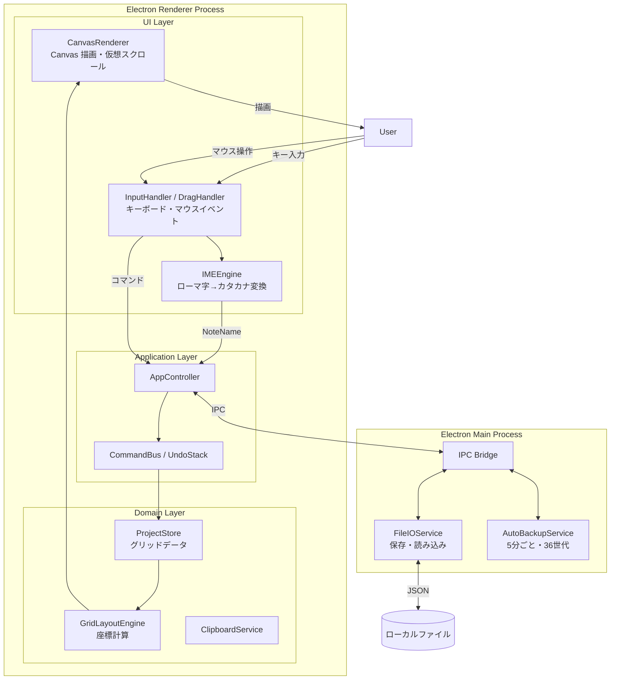

# アーキテクチャ概要

## 技術スタック

| 層 | 技術 |
|---|---|
| シェル | Electron (macOS) |
| レンダリング | HTML5 Canvas / OffscreenCanvas |
| ロジック | TypeScript |
| 状態管理 | イミュータブルなコマンドパターン（Undo/Redo 対応） |
| 永続化 | JSON ファイル（ローカルファイルシステム） |
| テスト | Vitest + fast-check（プロパティベーステスト） |

---

## 全体アーキテクチャ図



### レイヤー責務

| レイヤー | 責務 |
|---|---|
| UI Layer | Canvas 描画・キーボード/マウスイベント受信・IME 変換・ドラッグ検出 |
| Application Layer | コマンドのディスパッチ・Undo/Redo 管理 |
| Domain Layer | グリッドデータモデル・ビジネスロジック・クリップボード |
| Main Process | ファイル I/O・自動バックアップ（5分間隔・36世代）・OS 連携 |

### コマンドパターンによる状態管理

全ての状態変更はコマンドオブジェクトとして表現する。各コマンドは `execute()` と `undo()` を持ち、`CommandBus` / `UndoStack` で管理する。

```
dispatch(cmd) → undoStack.push、redoStack をクリア
undo()        → undoStack.pop して undo()、redoStack.push
redo()        → redoStack.pop して execute()、undoStack.push
```

---

## 主要なデータモデル

```typescript
// プロジェクト（1曲分のデータ）
interface Project {
  id: string;
  name: string;
  timeSignature: TimeSignature;
  defaultSystemBreak: number;               // 段ごとのデフォルト小節数（初期値: 4）
  localSystemBreaks: Record<number, number>; // 段ごとの個別設定（null で解除）
  tracks: Track[];
  createdAt: string;
  updatedAt: string;
}

// トラック
type Track = MelodyTrack | TextTrack;

interface MelodyTrack {
  id: string; type: 'melody'; name: string;
  currentNoteValue: NoteValue;  // 現在選択中の音価（初期値: 'eighth'）
  cells: MelodyCell[];
}

interface TextTrack {
  id: string; type: 'text'; name: string;
  cells: TextCell[];
}

// セル
interface MelodyCell {
  id: string;
  noteValue: NoteValue;
  noteName: NoteName | null;   // null = 未記入
  octave: number | null;       // SpecialNoteNameの場合はnull
}

interface TextCell {
  id: string;
  noteValue: NoteValue;
  text: string;                // 空文字 = 未記入
}

// シリアライズ形式
interface SerializedProject {
  version: number;             // スキーマバージョン（現在: 1）
  project: Project;
}
```

音名（`NoteName`）は 12 音（ド・ノ・レ・ネ・ミ・ハ・バ・ソ・ゾ・ラ・ジ・シ）と特殊音 3 種（x・ー・ッ）の計 15 種類。音価（`NoteValue`）は全音符〜32分音符と各種3連符の計 10 種類。

---

## Spec 一覧

| spec | 概要 | Issue |
|---|---|---|
| [grid-layout](.kiro/specs/grid-layout/) | グリッド表示・SystemBreak・BarLine・セル幅 | [#1](https://github.com/ky5bass/myscore/issues/1) |
| [melody-input](.kiro/specs/melody-input/) | NoteName 入力・IME エンジン・オクターブ自動決定・VerticalOffset | [#2](https://github.com/ky5bass/myscore/issues/2) |
| [octave-drag](.kiro/specs/octave-drag/) | ドラッグによる OctaveShift | [#3](https://github.com/ky5bass/myscore/issues/3) |
| [note-value](.kiro/specs/note-value/) | NoteValue 変更・セル吸収/分割 | [#4](https://github.com/ky5bass/myscore/issues/4) |
| [track-management](.kiro/specs/track-management/) | 複数トラック管理・TextTrack 入力 | [#5](https://github.com/ky5bass/myscore/issues/5) |
| [persistence](.kiro/specs/persistence/) | 保存/読み込み・Undo/Redo・コピー/ペースト | [#6](https://github.com/ky5bass/myscore/issues/6) |

各 spec の詳細は `.kiro/specs/<spec名>/` 配下の以下のファイルを参照:

- `requirements.md` — ユーザーストーリーと受け入れ基準
- `design.md` — 設計判断と実装詳細（判断の理由を含む）
- `task.md` — 実装タスクリスト（実装中のみ存在）
